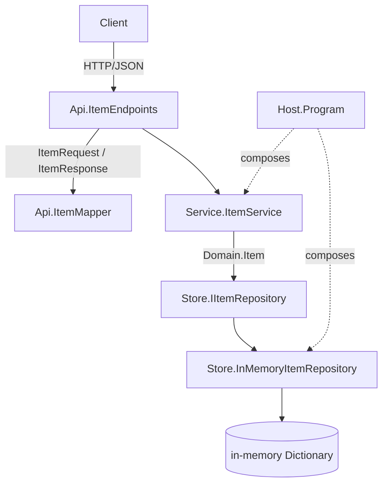

# Architecture

The service is a layered ASP.NET Core application. A request enters at the endpoint
group, which speaks DTOs, and travels down through the service, which speaks the domain
type, to an in-memory store adapter, which speaks the repository port. Each layer is a
separate assembly and depends only on the layer below it.

## Layers

- `src/Api/` holds the endpoint group, the transport DTOs, the RFC 7807 exception handlers, and the mapper between DTOs and the domain. It carries the `Microsoft.AspNetCore.OpenApi` annotations, so the OpenAPI document is generated from this code. It references `Service` and `Domain`, not `Store`.
- `src/Service/` holds the business logic. It works in `Domain.Item` and depends on the `Store.IItemRepository` port, not on the adapter.
- `src/Domain/` holds `Item`, the type the service reasons about, and `ItemNotFoundException`. It has no framework references.
- `src/Store/` holds the domain-facing port and the in-memory adapter that implements it, along with the three dev seeds.
- `src/Host/` is the composition root. `Program.cs` wires the OpenAPI document, the JSON options, the validation, the exception handlers, and the endpoints, and binds `IItemRepository`/`IItemService` to their implementations. It is the only project that references `Store`.

## Containment

The endpoint layer never sees a store type and the service never sees a DTO. The adapter
is the only place that writes to the dictionary, and `src/Api/ItemMapper.cs` is the only
place that converts between `Item` and the DTOs. Only the `src/Host/` composition root
references the adapter, and only to register it against the port. The assembly references
enforce the boundary, so the framework stays out of the domain and the business logic.

## Generated contract

`docs/openapi.json` is produced from the running application by
`Microsoft.AspNetCore.OpenApi`. `just spec` regenerates it; a test fails when the
committed document drifts from the generated one.
